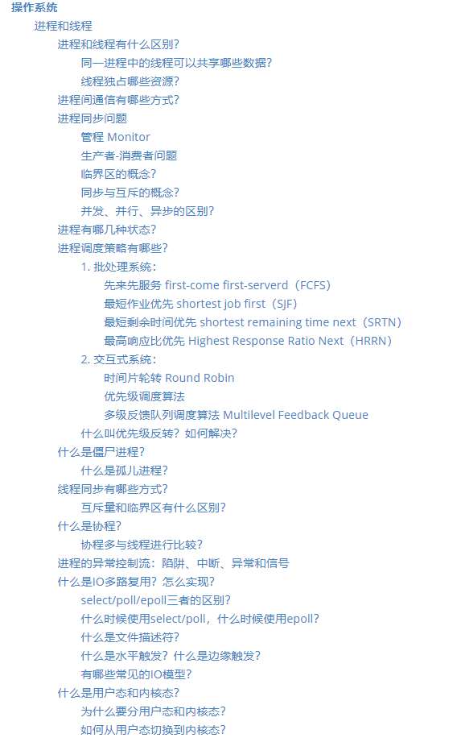
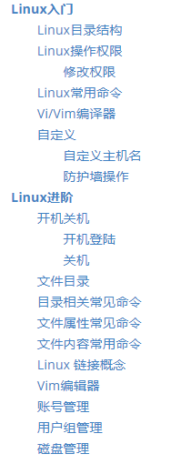
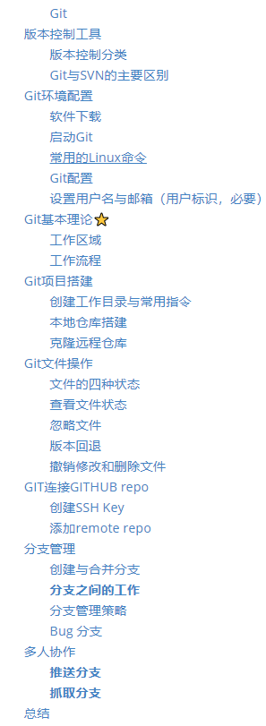
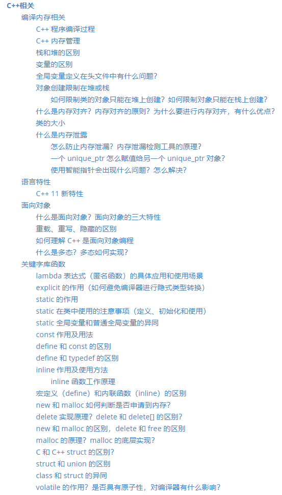

# “STAY HUNGRY. STAY FOOLISH”

> 求知若渴，虚心若愚 

这是我用来准备后端开发秋招面试的repo。按照计算机基础知识的不同版块，记录了一些入门级的教程以及面试中常见的问题以及比较规范的答案。我用它来在平时遇到忘记的知识点时以及在面试前回顾。

| &nbsp;&nbsp;&nbsp;计算机网络&nbsp;&nbsp;&nbsp; | &nbsp;&nbsp;&nbsp;操作系统&nbsp;&nbsp;&nbsp; | &nbsp;&nbsp;&nbsp;&nbsp;数据库&nbsp;&nbsp;&nbsp;&nbsp; | &nbsp;&nbsp;&nbsp;Linux&nbsp;&nbsp;&nbsp; | &nbsp;&nbsp;&nbsp;&nbsp;&nbsp;工具&nbsp;&nbsp;&nbsp;&nbsp;&nbsp; | &nbsp;&nbsp;&nbsp;&nbsp;C++&nbsp;&nbsp;&nbsp;&nbsp; |
| :--------------------------------------------: | :------------------------------------------: | :----------------------------------------------------: | :---------------------------------------: | :----------------------------------------------------------: | :-------------------------------------------------: |
|            [:cloud:](#1-计算机网络)            |          [:computer:](#2-操作系统)           |               [:floppy_disk:](#3-数据库)               |             [:art:](#4-Linux)             |                     [:wrench:](#5-工具)                      |                    [👨🏻‍💻](#6-cpp)                    |
|                     
                     |                                              |                                                        |                                           |                                                              |                                                     |

### 使用方法

文档中采用对每一个**知识点概述+衍生问题讲解**的形式。可以用于自测也可以当作面试前的**知识点梳理**，对一些细节问题进行复习。

注：知识还在积累中，不能保证每个回答都满足各种Level的高手们的👻

## 1. [计算机网络](Computer%20Network.md)

<a href="Computer%20Network.md" target="_blank"></img></a>

## 2. [操作系统](Operating%20Systems.md)

<a href="Operating%20Systems.md" target="_blank"></img> 
</img></a>

## 3. [数据库](Database.md)

<a href="Database.md" target="_blank"></img> 
</img></a>

## 4. [Linux](Linux.md)

<a href="Linux.md" target="_blank"></img></a>

## 5. [工具](Git.md)

<a href="Git.md" target="_blank"></img></a>

## 6. [Cpp](Cpp%20Handbook.md)

<a href="Database.md" target="_blank"></img> 
</img></a>

## 我的其他文档

+ [和算法约会（leetcode刷题笔记）](https://github.com/AHrunio/Dating-Algorithm)
+ [Redis入门](https://github.com/AHrunio/The-ABC-of-Redis)
+ [MySQL入门](https://github.com/AHrunio/MySQL-Introduction)
+ [使用Xshell连接阿里云服务器](https://github.com/AHrunio/Connect-to-Alicloud-Server-Using-Xshell)
+ [MySQL操作指南&&Navicate连接](https://github.com/AHrunio/MySQL-Operation-Guide)
+ [浅述Https加密机制](https://github.com/AHrunio/HTTP-Encryption)

待补充......🐱‍🏍

------------------

**"STAY HUNGRY, STAY FOOLISH"** 是乔布斯在给斯坦福大学毕业生做的演讲中所说的。上结合他的经历，会发现“求知若渴，虚心若愚”真的是很贴切的解释。有兴趣的话，可以把那个演讲视频找出来看一看。

